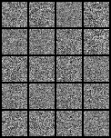

# Generative Adversarial Nets
## Authors: Ian J. Goodfellow, Jean Pouget-Abadie, Mehdi Mirza, Bing Xu, David Warde-Farley, Sherjil Ozair, Aaron Courville, Yoshua Bengio

PyTorch implementation of the original GAN paper.

## References
[paper](https://arxiv.org/abs/1406.2661)
